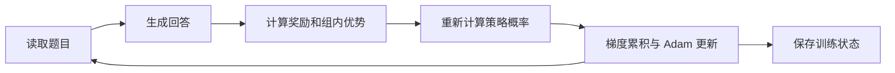

# 模型、训练与恢复的实现

模型参数按模块组织，作为 JAX 函数的输入；函数返回计算结果或更新后的训练状态。Python 训练循环负责读取数据、组织生成、计算奖励和保存文件；编译到 TPU 上的函数负责前向计算、梯度和参数更新。

## 模型参数如何进入训练

`weights.py` 从 Hugging Face 配置和权重文件建立本项目的参数结构，`model.py` 实现文本前向。代码处理逐层 attention 设置、滑窗和全局 attention、RoPE、共享 KV、逐层输入嵌入（PLE）、加宽 MLP 和 layer scalar。

权重转换需要同时对应名字、形状和公式。例如，这里的 RMSNorm 直接乘以权重，不能套用其他模型中 `1 + weight` 的写法；layer scalar 即使在源模型中被保存为 buffer，也会影响计算结果。输出头和 token embedding 共享权重，因此输出概率计算也会受到 embedding 分片方式的影响。

训练通常保留 FP32 主参数和 Adam 状态，前向与反向的主要计算使用 BF16。FP32 主参数用于累积较小的更新，BF16 减少计算和存储开销。冻结 embedding 后，优化器不为这些参数建立 Adam 动量，但主参数本身仍占用内存。

## 一个训练步包含哪些计算

一个训练步从当前模型参数开始，计算 loss 和梯度，再由优化器修改参数。本文中的“参数更新”就是最后这个操作；完成一次更新后，下一步使用修改后的参数继续计算。Adam 还会保留梯度的一阶和二阶统计量，帮助确定后续的参数调整幅度。

SFT 根据数据中给定的答案计算 loss，训练模型提高这些答案的预测概率。RL 先让模型生成回答，再根据奖励构造 loss，训练模型提高高奖励回答的概率。两种训练共用模型和概率计算，但训练数据和目标函数不同。

在 GRPO 中，一道题生成多个回答，奖励用于衡量同组回答的相对表现。常量奖励组本应没有组内学习信号；实现先相对组内第一项进行中心化，避免浮点均值误差被很小的标准差放大。

Dr. GRPO、DAPO、GSPO-token 和 RLOO 通过优势估计、概率比率、裁剪、归约和样本过滤等设置组合实现。`dapo` 包含动态补采，`dapo-loss` 只选择对应的损失函数。同一组生成数据可以更新多次，因此比较算法时，还要看生成量和耗时，不能只对齐 Adam 步数。

训练用 microbatch 控制内存。各 microbatch 的梯度按照完整训练 batch 的归一化规则累积，再执行参数更新；如果对每个 microbatch 独立平均后随意相加，就可能改变原来的目标函数。

## 为什么要区分几种概率

对模型输出的 logits `z`，完整策略概率为 `π(i) = exp(z_i) / Σ exp(z_j)`。训练目标可能用到不同参数版本和计算方式得到的概率：

| 概率 | 用途 |
|---|---|
| behavior | 实际产生这批回答时的策略概率 |
| old | 策略更新中计算概率比率的基准 |
| current | 当前参数在训练前向中重新计算的概率 |
| reference | 计算 KL 惩罚时使用的参考策略概率 |

刚开始更新时，部分策略可以共享参数；同一批数据更新多次或使用较旧策略生成的数据时，它们可能不同。保存参数版本和生成数据的对应关系，是检查这些概率是否用对的基础。

此外，模型的完整策略分布和实际采样分布也可能不同。原生生成返回的 `rollout_logps` 来自未经温度和 TopK/Top-p 修改的完整策略；温度缩放、候选过滤并重新归一化后，才得到真正用来选择 token 的采样分布。原生返回对象没有单独保存后者的 logprob 字段。

生成脚本开放温度、TopK 和 Top-p，但 RL 入口目前固定使用温度 1、完整词表采样，评估使用 greedy。若以后将截断采样用于 RL，必须一起检查重要性采样权重，不能只添加生成参数。

## 生成过程、缓存与采样

原生生成先对 prompt 做 prefill，再利用 KV cache 逐 token 解码。全局 attention 保存完整范围内的缓存，滑窗 attention 使用环形位置。批量解码放在 `lax.while_loop` 中执行，减少每个 token 都与 CPU 交接的开销。

已经结束的回答会通过 mask 排除后续位置，但固定 batch 仍可能保留无效槽位。这套生成器主要面向批量后训练，没有通用 serving 系统的请求队列和 continuous batching。

随机采样依次应用温度、TopK 和 Top-p。Top-p 保留使累计概率达到阈值的那一项，并保证至少留下一个候选。例如概率为 0.5、0.3、0.2，设置 `top_p=0.6` 会留下前两项，实际采样概率变成 0.625、0.375。先做 TopK 再做 Top-p 时，累计概率按 TopK 候选重新归一化。greedy 则直接取最大 logit。

TPU 上默认 exp/log 的近似精度曾造成可测量的 logprob 偏差。目前归一化中的 `lax.exp` 和 `lax.log` 显式使用 `AccuracyMode.HIGHEST`；仅设置 `JAX_DEFAULT_MATMUL_PRECISION=highest` 不会控制这些数学算子。训练配置中的 `fp32-exp-log-highest-v1` 用于标识这一计算方式，恢复时也会检查它。

训练使用完整序列前向，生成使用 cache 解码。即使参数相同，这两种计算图仍可能因 BF16 舍入顺序产生概率差异，因此训练记录会比较生成概率与重新计算的概率。

`completion_mask` 包含第一枚 EOS，排除其后的位置。prompt 的左侧 padding 根据 attention mask 去除，不能仅按 token 数值删除。评估保存真实的输入和生成 token，并按有效长度截取，方便之后重新解码；它们不是对显示出来的文本重新分词得到的。

## 分片与内存

单机 TPU v4-8 在这些实验中表现为四个 JAX 芯片设备；profiler 中的八个 TensorCore 是不同层次的计数。FSDP 将参数和优化器状态分到设备上，在计算时进行必要的通信。生成可以使用不同的布局，更新前再切回训练布局。

目标 token 的 logprob 需要完整词表的归一化，但不必一次物化整个 `[B,T,V]` logits。实现沿序列和词表分块计算 log-sum-exp，并提取目标 token 的分数。显式词表并行进一步在设备的局部词表上计算，再合并全局归一化结果，减少整张输出权重的收集。

其他内存手段包括梯度累积、重计算（remat）和 buffer donation。重计算用额外计算换取更少的激活存储；donation 允许编译器复用不再需要的旧状态。实际收益取决于最终计算图，返回全部梯度的诊断函数与返回更新状态的训练函数，可能具有不同的融合方式和内存占用。

## 保存哪些状态，怎样恢复

完整 checkpoint 不只有模型权重，还包含 Adam 状态、全局步数、随机状态，以及继续读取数据所需的位置。`state.safetensors` 保存数组，`meta.json` 保存训练配置、数据进度和每个数组的名字、形状、类型。

保存时先建立文件头，再一次处理一个张量：从设备传到主机、写入文件、释放临时副本。所有内容写完后，才把临时目录改名为目标目录，并拒绝覆盖已有结果。这样可以避免在主机同时保留整个训练状态的 NumPy 副本，但仍需给最大张量的临时副本留出空间。E2B 的最大 PLE 张量约 8.75 GiB，完整状态文件约 31.23 GiB；输出放在 tmpfs 时，文件本身也会占用主机内存。

恢复时先检查全部数组的名字、形状、类型，以及设备分片结构是否匹配。检查通过后，依次读取和传输各个数组，等待传输结束再处理下一个。等待操作很重要：如果只提交异步传输，队列仍可能同时保留许多主机数组。传输失败时会释放已创建的设备结果，包括在等待完成时发生错误的当前数组。若文件包含 64 位数组，而 JAX 没有启用相应精度，恢复会在分配前报错，避免静默降成 32 位；需要保留这些数组时，在启动前设置 `JAX_ENABLE_X64=1`。

新文件使用 `gemma4_posttrain_jax-train-state` 标识和版本 1，读取器同时接受初版文件的标识。格式兼容只说明文件能读；继续训练还需要模型、数据、采样数学和训练配置一致，旧采样配置缺失或不同的状态会被拒绝。

恢复示例比较连续训练与从第 2 步恢复后的第 4 步结果。检查覆盖最终文件、Adam、数据读取位置、随机状态、全部生成样本和独立评估。动态补采会消耗后来没有进入更新的样本，因此这些样本也要记录。原生生成在新 batch 开始时重建 KV cache，这个例子不恢复进行到一半的解码，也不覆盖远程引擎的 paged cache。

## 外部推理引擎

tpu-inference 适配层负责将训练权重转换成引擎布局、更新版本、清除失效缓存，并传递随机状态。它可以在同一进程中运行，也可以使用独立进程；独立进程本身不代表训练和生成已经并行重叠。

外部引擎需要匹配指定的 Python 环境、源码和 libtpu，普通安装不会自动准备这些依赖。权重更新、缓存、随机状态和故障退出都需要单独验证，原生生成的测试结果不能直接覆盖引擎实现。

## 对照源码阅读

| 文件 | 主要内容 |
|---|---|
| [model.py](../gemma4_posttrain_jax/model.py)、[weights.py](../gemma4_posttrain_jax/weights.py) | 文本模型和 HF 权重转换 |
| [losses.py](../gemma4_posttrain_jax/losses.py)、[algorithms.py](../gemma4_posttrain_jax/algorithms.py) | 概率、梯度、损失和算法设置 |
| [sampler.py](../gemma4_posttrain_jax/sampler.py) | prefill、解码、缓存和采样 |
| [sharding.py](../gemma4_posttrain_jax/sharding.py)、[checkpoint.py](../gemma4_posttrain_jax/checkpoint.py) | 设备布局、保存和恢复 |
| [train_grpo.py](../scripts/train_grpo.py)、[evaluation.py](../gemma4_posttrain_jax/evaluation.py) | 训练循环与逐题评估 |
