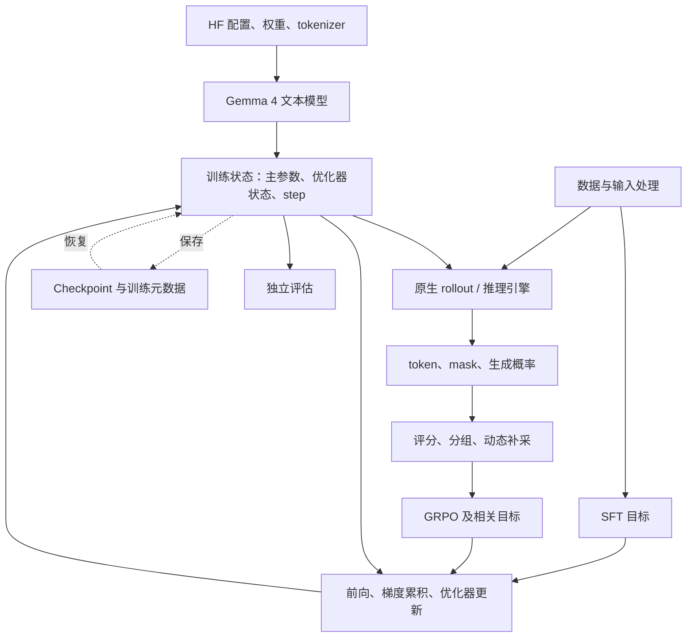

# 整体设计

本项目围绕 Gemma 4 E2B 文本模型，在 JAX/TPU 上实现监督微调（Supervised Fine-Tuning，SFT）和基于组相对策略优化（Group Relative Policy Optimization，GRPO）的强化学习训练。模型、目标函数、生成和状态管理分别实现，由训练入口组合成完整流程。

核心计算采用显式参数输入和状态返回。Python 主机循环负责数据、评分、流程调度和文件操作；JAX 编译函数负责模型前向、反向传播、优化器更新与原生生成。原生 JAX rollout 是默认路径，tpu-inference 通过适配层作为可选实验后端接入。

## 1. 总体架构

SFT 使用数据中的目标回答；RL 使用模型生成并经过评分的回答。两条路径共享模型前向、目标 token 的对数概率（log-probability，简称 logprob）计算、优化器、分片和保存格式，区别集中在输入组织与目标函数。

| 层次 | 主要职责 | 实现 |
|---|---|---|
| 模型与权重 | 读取 HF 配置、映射权重、执行文本模型前向 | [weights.py](../gemma4_posttrain_jax/weights.py)、[model.py](../gemma4_posttrain_jax/model.py) |
| 训练计算 | 构造算法目标、计算梯度、累积 microbatch、更新参数 | [algorithms.py](../gemma4_posttrain_jax/algorithms.py)、[losses.py](../gemma4_posttrain_jax/losses.py) |
| 原生生成 | 预填充、缓存解码、采样及生成结果记录 | [sampler.py](../gemma4_posttrain_jax/sampler.py) |
| 数据与评估 | 数据顺序、问题身份、输入处理、评分与评估记录 | [data.py](../gemma4_posttrain_jax/data.py)、[evaluation.py](../gemma4_posttrain_jax/evaluation.py) |
| 设备布局 | 参数、训练状态和批次的分片规则 | [sharding.py](../gemma4_posttrain_jax/sharding.py) |
| 保存与恢复 | 数组序列化、格式检查、按目标布局加载 | [checkpoint.py](../gemma4_posttrain_jax/checkpoint.py) |
| 训练入口 | 组织生成、更新、评估、保存及新进程恢复 | [train_sft.py](../scripts/train_sft.py)、[train_grpo.py](../scripts/train_grpo.py) |

## 2. 模型与训练状态

模型实现保留 Gemma 4 的逐层注意力类型、共享键值、滑动窗口、逐层输入嵌入（Per-Layer Embeddings，PLE）、旋转位置编码（Rotary Position Embedding，RoPE）及逐层缩放。输入 embedding 与输出头共享权重。HF 映射同时处理参数名称、维度布局和计算语义，[前向测试](../tests/test_model_ops.py)和[梯度对照](../tests/test_grad_parity.py)检查它与 Transformers 的对应计算。

`TrainState` 包含三个字段：`params_f32`、`opt_state` 和 `step`。默认保留 FP32（32 位浮点）主参数与 Adam 优化器状态，模型计算可使用 BF16（bfloat16，16 位浮点）。优化器对主参数写回，避免每步只保留 BF16 计算副本而丢失较小的参数变化。冻结 embedding 时省去相应的可训练优化器状态，前向仍读取完整权重。

模型配置、tokenizer、数据流及日志不放入设备上的 `TrainState`。这些对象由训练入口管理，需要继续训练的信息通过 checkpoint 元数据保存；基础模型和数据文件仍由使用者提供。

## 3. 训练与生成接口

RL 入口依次组织问题、生成回答、评分、计算 advantage（优势估计），再对固定回答执行训练更新。一次生成可以对应 μ 次优化器更新；microbatch（微批次）则在每次更新内部累积梯度。两者使用不同的计数，拆分 microbatch 不增加 Adam 更新次数。

生成结果采用 `RolloutBatch`：

| 字段 | 约定 |
|---|---|
| `prompt_ids` | 生成时使用的问题 token |
| `completion_ids` | 实际生成的回答 token，训练直接使用这些 token |
| `completion_mask` | 有效回答位置；包含第一个 EOS（End of Sequence，序列结束标记），排除后续填充 |
| `rollout_logps` | 生成参数下的原始策略 logprob，无效位置为零 |
| `lengths` | 每条回答的有效长度 |

文本用于评分和展示，训练与评估保留实际 token，避免重新分词改变输入。奖励、mask 和算法配置交给训练函数；训练函数返回新状态及指标，主机据此决定下一次生成、评估和保存。

训练区分四种概率来源：Behavior 是实际生成策略；Old 在本批第一次训练计算中固定；Current 在每次更新时重新计算并参与求导；Reference 来自固定参考模型，供可选的 KL 散度（Kullback–Leibler Divergence）正则项使用。即使参数相同，缓存解码和完整序列训练也可能产生不同的浮点结果，因此 Old 从实际更新计算中捕获。

原生 `rollout_logps` 来自未经温度或 TopK/Top-p 修改的完整词表分布，当前 RL 入口采用温度 1、完整词表采样。生成 CLI 的其他采样选项不能自动沿用这一概率约定。具体目标、概率修正和算法差异见[GRPO 及相关算法](grpo-and-related-algorithms.md)。

## 4. JAX/TPU 执行与内存

主机负责数据读取、tokenizer、文本奖励、动态补采、日志和文件；模型及优化器计算通过 `jax.jit` 编译到设备。原生生成先执行 prefill（预填充），随后在 `lax.while_loop` 中使用 Key-Value Cache（键值缓存，KV cache）逐 token 解码。全局注意力保留完整缓存，滑动窗口注意力使用环形存储。当前采用固定批次，没有通用 serving 系统的动态请求队列。

设备布局使用单主机一维 mesh（设备网格），命名轴为 `d`。主要实验环境 TPU v4-8 对应 4 个 JAX 芯片设备。训练采用全分片数据并行（Fully Sharded Data Parallel，FSDP）风格的参数存储，梯度和 Adam 状态保留相应布局；向量和标量通常复制，必要通信由编译器插入。生成可以使用不同布局，切换成本计入完整训练迭代。

训练 logprob 分块计算 log-sum-exp，并提取目标 token 分数，减少完整 `[batch, sequence, vocabulary]` logits 的存储。显式词表并行进一步让各设备处理自己的词表区间，合并归一化统计量，控制大权重的通信。实现集中在 [losses.py](../gemma4_posttrain_jax/losses.py)。

内存控制分别作用于不同对象：microbatch 减小同时计算的样本数；重计算（rematerialization，remat）减少保留的激活；buffer donation 允许编译器复用调用后不再使用的输入存储。训练入口在实际 Adam 更新函数上验证内存和耗时，诊断函数返回全部梯度时的结果单独记录。

策略名称不等于模型副本数。当前训练的主要存储如下：

| 对象 | 位置、精度与存活期 |
|---|---|
| 当前训练参数 | 训练 TPU 上的一套 FP32 主参数，按训练 mesh 分片；计算图按需要产生 BF16 计算值 |
| Adam 状态 | 训练 TPU 上可训练参数的一阶矩和二阶矩，均为 FP32；冻结参数不保存对应的 Adam 矩 |
| 原生生成参数 | 生成阶段由主参数转换为 BF16，可复制或分片；生成结束后释放这份工作副本 |
| 引擎生成参数 | 推理 TPU 上的 BF16 权重；当前 DP2/TP1 配置在两颗推理芯片上各有完整副本 |
| Old 与 Behavior 概率 | 固定回答的 FP32 logprob 数组，不各自保存一整份模型；Old 按需要捕获，Behavior 来自生成结果 |
| Reference 参数 | 仅启用 KL 时建立；固定 BF16 副本放在 CPU，计算参考概率时临时放入训练 TPU，计算后释放 |

因此，同步的 2+2 引擎配置通常保留一套分片的 FP32 训练主参数，以及推理侧两个物理 BF16 副本，并另有优化器状态。原生路径在同一训练 mesh 上轮流生成和更新；默认复制布局会在每颗芯片放置 BF16 生成副本，但不让它与 Reference 参数同时常驻。启用顺序滞后时，另在 CPU 保存较旧的 BF16 行为策略快照。KV cache、激活、梯度以及同步时的新旧权重重叠都影响峰值 HBM，不能只按策略名称或模型份数估算。

## 5. 保存与恢复

checkpoint（检查点）由数组文件和元数据组成。`state.safetensors` 保存参数、优化器状态和计数；`meta.json` 保存格式、数组描述，以及入口提供的运行配置和数据进度。保存器从本进程可访问的设备分片分块读取，按数组的逻辑顺序写入文件，单次读回最多 64 MiB，避免为了保存大参数而在主机拼出完整数组。写完临时目录后再改名；加载器先检查全部数组的名称、形状和类型，再按调用方提供的目标 sharding（分片）恢复。分块读取没有改变文件格式，也不等于实现了跨主机联合保存。

SFT 保存数据流状态；原生 GRPO 单独记录候选批次位置 `data_cursor`，使用 `fold_in(base_key, data_cursor)` 派生随机 key。动态补采中被过滤的候选也推进这一位置，因此不能用 Adam 的 `step` 代替。启用顺序滞后生成时，还需保存行为策略快照及版本。

当前 GRPO 的保存点位于完整 μ 次更新结束后。下一轮重新生成，可以重建 KV cache，无需保存半轮解码和未完成的梯度累积。恢复进程重新建立 mesh、目标分片和编译函数，文件不保存旧设备对象或 executable。

现有支持主要针对单主机及已验证配置；跨主机、任意布局改变后的相同轨迹、解码中途及异步队列恢复需要单独实现和验证。[GRPO 恢复示例](../examples/e2b_grpo_recovery.sh)组合连续训练、独立恢复、重载评估及结果比较。

## 6. 原生 rollout 与 tpu-inference

原生 JAX rollout 是默认生成路径，使用 `--rollout-backend jax`。接入 tpu-inference 时，**推荐训练与引擎模型执行位于同一进程，通过 ICI 同步权重**：选择 `--rollout-backend inference`，保留 `--inference-weight-transport auto` 即使用这一路径。

ICI（Inter-Chip Interconnect）是 TPU 的芯片间互联，原生 rollout 也会使用。两种生成后端的区别在于设备如何分配、权重在哪里使用，以及何时需要交换数据：

| 生成路径 | 当前设备使用方式 | ICI 通信在做什么 |
|---|---|---|
| 原生 rollout，默认 `--rollout-layout replicated` | 训练和生成轮流使用同一组四个 chip；生成时每个 chip 有完整 BF16 权重 | 生成前，将训练时分片存储的权重转换为各 chip 的完整副本，需要跨芯片汇集数据 |
| 原生 rollout，`--rollout-layout fsdp` | 训练和生成仍使用同一组四个 chip；生成权重继续分片 | 生成计算中，由 JAX/XLA 根据分片布局安排所需的跨芯片通信 |
| tpu-inference，推荐的同进程 ICI 配置 | 训练与引擎共享进程和 JAX 运行时；当前默认训练两芯、推理两芯 | 将训练侧最新权重传给另一组推理 chip，并转换成引擎所需的类型和布局 |

原生路径的权重转换由 [reshard_for_rollout](../gemma4_posttrain_jax/sharding.py) 完成。训练和生成使用同一组 chip，仍可能需要重分片通信；默认复制布局在生成前准备完整权重，不要求每个 decode step 都重新同步整套权重。

[InferenceRollout](../gemma4_posttrain_jax/inference_rollout.py) 将 tpu-inference 接入同一生成接口。训练器保留主参数和优化器，适配层完成参数同步、版本检查和生成结果转换；[权重映射与检查](../gemma4_posttrain_jax/inference_weights.py)处理引擎需要的类型、布局及内容验证。参数同步携带递增版本，生成请求与返回结果核对期望版本；引擎后端同时负责权重切换后的缓存失效、随机状态和进程生命周期。

这里的“同进程”指训练计算与引擎模型执行在同一个进程中，仍允许辅助子进程。当前接入在导入引擎前设置 `VLLM_ENABLE_V1_MULTIPROCESSING=0` 和 `TPU_MULTIPROCESS_DP=0`，并核对实际使用 `InprocClient` 及 `UniProcExecutor`；DP 调度器仍会启动 CPU 调度子进程。本项目通过 Python 接口调用推理引擎，无需另启 HTTP 服务。

其余进程和传输方案仅保留为开发过程中的对照实现，用于复现和分析不同运行时、权重传输与进程隔离行为，不作为常规使用推荐：

| 开发对照配置 | 保留的实现 |
|---|---|
| `--rollout-backend inference-process` | 两个独立 Python 进程和 JAX 运行时，可使用不同依赖环境；当前各使用两芯，通过主机中转权重 |
| `--rollout-backend inference-distributed` | 两个 Python 模型进程使用相同 JAX/libtpu 环境，共同初始化分布式运行时；当前各持有两芯，通过 ICI 同步权重 |

`--inference-weight-transport auto` 在上述两种开发配置中分别选择主机中转和 ICI。共同分布式运行时需要调用方预先建立，再分别启动训练与接收端；仅切换传输选项或直接运行训练脚本不会自动完成初始化。这些双进程实现不表示训练与生成已经重叠执行。

tpu-inference 接入仍依赖对应的固定引擎环境与 libtpu，完整模型的生成、训练、保存与恢复需要按配置验证。同步数组测试只覆盖传输本身；当前也没有这些进程布局在相同条件下的完整训练速度排名。
