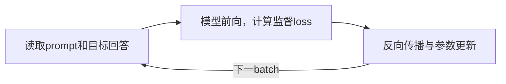
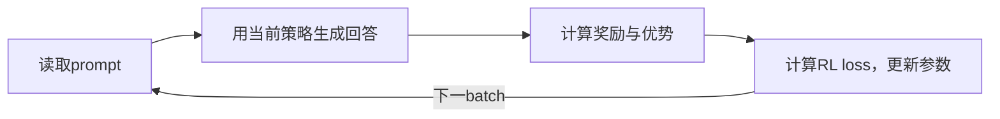

# 设计与实验结果

本项目在单机TPU v4上实现Gemma 4的SFT和强化学习训练。模型、loss与batch生成使用函数式JAX，优化器使用Optax；训练默认使用纯JAX rollout，也提供实验性的tpu-inference适配。

本文介绍实现方式、代表实验及其适用范围。实验以真实E2B为主，E4B、12B和CPU测试单独注明。表中是已完成实验的结果，当前代码尚未进行完整测试；不同模型、算法和后端组合的支持程度见各节说明。

## 设计结构

模型参数、优化器状态和随机状态显式传入计算函数。训练脚本负责读取数据、组织采样与更新、保存checkpoint；JAX编译后的函数负责前向、梯度与参数更新。

SFT使用数据集中的目标回答计算loss。

RL先生成回答，再根据奖励计算优势，用生成时的策略概率和当前模型的概率构造训练目标。

**SFT训练循环**



**RL训练循环**



SFT与RL没有必然的先后关系，都可以从已有模型权重开始。是否先做SFT、再将其权重作为RL起点，由使用者选择。两条流程各自维护训练状态，都支持保存checkpoint和调用独立评估入口。

RL的生成步骤可选择纯JAX rollout或tpu-inference。训练时仍需计算当前策略的前向和梯度；同一batch的生成数据也可以执行多次更新。

| 部分 | 实现职责 | 代码 |
|---|---|---|
| 模型与权重 | Gemma 4文本前向、KV cache、Hugging Face权重转换 | [model.py](../gemma4_posttrain_jax/model.py)、[weights.py](../gemma4_posttrain_jax/weights.py) |
| 训练目标 | SFT loss、策略概率、优势与RL目标 | [losses.py](../gemma4_posttrain_jax/losses.py)、[algorithms.py](../gemma4_posttrain_jax/algorithms.py) |
| 纯JAX rollout | prefill、batch decode、随机采样与停止处理 | [sampler.py](../gemma4_posttrain_jax/sampler.py) |
| 引擎适配 | tpu-inference生成、权重更新、随机状态与进程通信 | [inference_runtime.py](../gemma4_posttrain_jax/inference_runtime.py)、[inference_remote.py](../gemma4_posttrain_jax/inference_remote.py) |
| sharding与训练状态 | 多设备参数放置、训练与生成的布局切换、保存和恢复 | [sharding.py](../gemma4_posttrain_jax/sharding.py)、[checkpoint.py](../gemma4_posttrain_jax/checkpoint.py) |

纯JAX rollout与本项目的Gemma 4参数结构、KV cache和sharding配合使用。目前主要面向batch后训练，没有通用在线服务的请求队列、continuous batching和跨模型调度。

## 模型实现与精度

文本模型支持逐层attention配置、滑窗与全局attention、RoPE、共享KV、逐层输入嵌入（PLE）、double-wide MLP和layer scalar。输出头与token embedding共享权重，加载器从Hugging Face模型配置和权重文件恢复这些结构，并读取停止token设置。

权重转换需要同时检查公式和文件内容。例如，这里的RMSNorm直接乘以权重，不能套用其他模型的`1 + weight`；`layer_scalar`即使作为buffer保存，也会影响计算结果。

以下测试将本项目与Hugging Face Transformers的Gemma 4实现比较，使用同一来源的权重和相同输入，双方计算精度分别注明。

| 比较设置 | 实测结果 | 测试范围 |
|---|---|---|
| 真实E2B：JAX与Transformers，均为CPU FP32 | 末位logits最大绝对误差约4.96e-5；13个greedy token一致 | 固定短输入 |
| 真实E2B：JAX单芯片TPU BF16与Transformers CPU FP32 | 普通文本和聊天输入各13个greedy token一致 | 两种固定短输入 |
| 小模型梯度：JAX与Transformers，均为CPU FP32 | 全梯度相对L2误差约1.000e-5，最大单个参数数组约1.924e-5 | CPU数学测试，要求低于1e-4 |

短输入的token一致只覆盖这些测试，长生成仍可能因小概率差异逐渐分叉。视觉、音频和所有Gemma 4变体不在上述测试范围内。

真实训练通常使用BF16计算，并保留FP32主参数和Adam状态。FP32主参数用于累积小的更新，BF16用于降低模型计算与存储成本。相同dtype仍可能因matmul精度、归约顺序和算子融合产生不同结果。

对应测试：[模型算子](../tests/test_model_ops.py)、[真实E2B](../tests/test_real_e2b.py)、[梯度比较](../tests/test_grad_parity.py)。

## sharding与训练内存

sharding把参数或batch沿指定维度分到多个设备。实验使用的TPU v4-8通常按4个JAX芯片设备组织；profiler中的8个TensorCore是另一层计数。FSDP训练将参数和优化器状态分布到设备上，计算时完成所需通信；rollout可以使用不同布局，再切回训练布局。

内存控制主要包括梯度累积、流式logprob、remat和buffer donation。梯度累积把一个训练batch拆成多个microbatch；remat在反向时重算部分激活；donation允许编译器复用不再使用的旧状态缓冲区。实际收益取决于编译后的计算与内存安排。

### 实验配置的记法

| 记号 | 含义 |
|---|---|
| B | RL中一轮采样的题目数；纯推理实验中是请求数 |
| G | 每题生成几个回答，RL实际展开为B×G条 |
| P / N | prompt填充宽度 / 最大新增token数，实际回答可能更短 |
| T | SFT训练序列的填充宽度 |
| micro | 每次梯度计算处理的训练行数，与引擎请求容量不同 |
| μ | 同一batch的生成数据执行几次Adam更新 |
| full-text | 训练全部文本参数，包括embedding |
| full-core | 冻结embedding，训练其余核心参数 |

例如，B32、G8、micro8表示一轮生成256条回答，梯度计算每次处理8条；不能把它理解为推理batch只有8。

### 大词表logprob与通信优化

SFT和RL需要目标token的logprob，直接生成完整的`[B,T,V]` logits会占用大量内存。当前实现沿序列和词表分块，累计归一化所需的log-sum-exp，同时提取目标token的分数。

词表并行进一步让输出头在各设备的局部词表上计算，再合并归一化结果。在真实E2B的对照中，编译图里两次、每次768 MiB的完整embedding all-gather被消除。

| E2B，B8×T1024，full-text，BF16 | 稳态训练步均值 |
|---|---:|
| 自动分片的对照实现 | 9.20146秒 |
| 显式词表并行logprob | 0.405784秒 |

这组配置约提速22.68倍。loss逐位一致，全梯度相对L2误差约0.003962，满足该BF16实验预设的1e-2要求；它与CPU FP32梯度测试采用不同误差要求。

优化目标来自HLO和profile中的通信热点。这个结果说明该配置的主要瓶颈曾在输出头与通信，不能只根据模型属于Transformer就决定先优化attention。

### 与MaxText的计算对照

固定MaxText 0.2.4 Linen、真实E2B、4芯片、B4×T512、全FP32，测量前向、反向并返回梯度的计算图：

| 实现 | 稳态均值 |
|---|---:|
| 本项目 | 568.460 ms |
| MaxText | 826.377 ms |

本项目在这个计算范围内约快1.454倍。相同配置下MaxText的完整AdamW步骤发生HBM OOM，因此这组结果不能表述为完整训练速度对比。

另一个值得注意的现象是，包含优化器和donation的完整训练图可能比返回全部梯度的图更快。原因需要结合输出存活时间、融合和内存复用分析；计时必须覆盖实际要使用的计算图。

TPU sharding测试会检查参数放置、前向、梯度和更新，以及训练与rollout切换布局后的结果。测试入口：[test_sharding_tpu.py](../tests/test_sharding_tpu.py)。

## 纯JAX rollout

rollout给模型一个batch的prompt，生成回答，并返回token、有效长度、mask和logprob供RL训练使用。实现先做prefill，再使用KV cache逐token生成；全局attention和滑窗attention分别管理缓存，滑窗使用环形位置。

batch生成循环放在`lax.while_loop`中：一个batch的请求进入设备后，设备重复执行前向、选token和更新cache，减少每个token都与CPU交接的开销。已结束的回答由mask处理，但固定batch仍可能保留无效槽位，不能自动获得continuous batching的效果。

### 采样方式

| 方式 | `SamplerConfig`设置 | 选token的规则 |
|---|---|---|
| Greedy | `temperature=0` | 选概率最高的token |
| 完整词表随机采样 | `temperature>0, top_k=0, top_p=1` | 用temperature调整分布，再从完整词表采样 |
| TopK随机采样 | `temperature>0, top_k=k, top_p=1` | 从概率最高的k个候选中采样，k不超过词表大小 |
| Top-p随机采样 | `temperature>0, top_k=0, top_p=p` | 按概率从高到低保留候选，直到累计概率达到p |
| TopK＋Top-p | `temperature>0, top_k=k, top_p=p` | 先取TopK，在这些候选重新归一化后做Top-p |

`top_p`的范围为(0,1]，1表示关闭Top-p；greedy直接选择最大logit，不使用TopK或Top-p过滤。随机采样先应用temperature，再应用TopK和Top-p。例如概率为0.5、0.3、0.2，设置`top_p=0.6`会保留前两项，实际采样概率变为0.625、0.375。

[generate.py](../scripts/generate.py)调用同一个batch采样器，开放temperature、TopK、Top-p和seed。重复传入`--prompt`即可在一个设备上batch生成：

```bash
.venv/bin/python scripts/generate.py \
  --model /path/to/gemma4-snapshot --chat \
  --prompt "计算3乘4再加2。" --prompt "解释什么是梯度。" \
  --temperature 0.8 --top-k 50 --top-p 0.9 --seed 42 \
  --max-new-tokens 128
```

`--temperature 0`使用greedy；`--top-k 0 --top-p 1`关闭两种截断。生成计时包含首次编译、prefill和decode，稳态吞吐请使用独立的benchmark入口。

增加`--compare-hf`会同时用Hugging Face Transformers在CPU上以FP32加载同一模型，使用相同输入、停止条件和采样设置，显示两边的回答。greedy会比较token；随机采样因框架的随机数实现不同，相同seed不保证相同回答，不用逐token一致作为正确性要求。

RL训练入口当前仍固定使用`temperature=1, top_k=0, top_p=1`，评估使用greedy。生成器支持这些采样方式，不表示RL入口已开放全部采样参数；tpu-inference训练适配目前也只接受`top_p=1`，其他值会明确报错。

记录的rollout logprob来自未经temperature调整、TopK或Top-p截断的完整策略分布。使用不同采样分布时，训练还需要区分模型概率与实际采样概率，不能把两者混用。

### TPU采样精度

补充Top-p测试时，CPU对照通过，但TPU上的完整策略logprob出现约3.65e-5的绝对误差，超过测试原定的2e-6要求。关闭Top-p后，旧采样器与新增实现的token和logprob逐位一致，说明这不是Top-p过滤新增的偏差。

进一步将同一输入分别交给TPU默认`log_softmax`和显式高精度实现：前者对NumPy FP64参考的最大误差为3.6505e-5，后者为1.3904e-7。当前采样器为归一化中的`lax.exp`和`lax.log`显式指定`AccuracyMode.HIGHEST`；Top-p累计概率也使用高精度exp。仅设置matmul的`highest`不会同时控制这些数学算子。

测试仍保留2e-6的误差要求，37项TPU采样、生成入口与保存测试全部通过。在B32、262144词表的五组采样检查中，完整策略logprob与NumPy FP64参考的最大绝对误差不超过1.09e-6。真实E2B也完成greedy、Top-p和TopK＋Top-p三组batch生成，每组两条输入、最多新增16个token；这属于短生成验证，不是回答质量评估。

高精度归一化有小幅开销。同一B32、262144词表输入下，预热后交替执行旧版和新版，各测10次，得到以下中位数。三组关闭Top-p的测试中，选出的token均未改变。

| 采样设置 | 旧归一化 | 高精度归一化 | 增加的时间 |
|---|---:|---:|---:|
| Greedy | 0.371 ms | 0.440 ms | 约0.069 ms |
| 完整词表随机采样，temperature=1 | 0.944 ms | 1.001 ms | 约0.056 ms |
| TopK=50，temperature=0.8 | 2.567 ms | 2.634 ms | 约0.068 ms |

这些时间只覆盖采样与logprob计算，不能换算成完整rollout的速度变化。修正会改变部分logprob数值；训练配置记录采样数学协议，旧协议的checkpoint不能直接声称可逐位续训。历史吞吐和质量数字也不视为本次修改后的重测结果。

### KV cache与训练前向

KV cache保存历史token的K/V，减少生成下一token时的重复计算；JIT cache保存编译结果。它们没有为训练保留完整反向传播所需的激活，训练计算当前策略的loss和梯度时仍需要前向。

采样测试将每组logits重复8,192次，用Transformers的独立过滤器核对候选集合和采样频率，并核对完整策略logprob。生成测试覆盖左填充、滑窗cache回绕、EOS后的mask、固定随机状态的重复性及多设备布局。入口：[采样测试](../tests/test_sampler.py)、[rollout布局测试](../tests/test_rollout_layout.py)；batch测速使用[benchmark_rollout.py](../scripts/benchmark_rollout.py)。

Top-p排序可能是明显的开销。在B32、262144词表的合成FP32 logits上，temperature=0.8、top_p=0.9的完整词表采样约需86.25 ms/步；先保留TopK=50再做Top-p约需2.64 ms/步。这是预热后三次测量的中位数，两种设置定义不同的采样分布，不能视为等价优化，也不代表真实模型的整段生成耗时。

## SFT与强化学习结果

### SFT

SFT使用目标回答的token计算监督loss，通过梯度累积控制每次更新的内存。下面两组实验分别检查训练通路和真实数据上的loss变化。

| E2B实验 | 配置 | 结果 |
|---|---|---|
| 单个batch过拟合 | 冻结embedding，B8×T128，100步 | loss从3.644784降至约5.809e-5 |
| GSM8K SFT | B8×T512，200步 | 前20步loss均值0.912670，后20步0.429116，下降约53.0% |

单个batch过拟合验证模型能学习给定数据，训练loss下降不直接代表测试准确率。不同数据格式和训练配置需要重新测量。训练入口：[train_sft.py](../scripts/train_sft.py)。

### GRPO与算法变体

RL训练依次生成回答、计算奖励和组内优势，再结合生成时、参考模型及当前模型的logprob计算训练目标。microbatch梯度按照完整训练batch的归一化规则累积后执行Adam更新。

支持的算法包括GRPO、Dr.GRPO、DAPO、GSPO-token和RLOO。`dapo`包含动态补采；`dapo-loss`只选择损失形式。动态补采会增加生成量，同一采样batch重复更新也会改变计算预算，比较算法时需要同时记录Adam步数、生成token数和耗时。

在E2B、full-text、BF16计算/FP32状态、B32、G8、P512、N1024、micro8、μ1、seed0下，分别使用β=0和β=0.04训练300次Adam；β是KL惩罚的系数。

| 固定500题监测集 | 初始准确率 | 第300步准确率 | 变化 |
|---|---:|---:|---:|
| β=0 | 89.2% | 90.6% | +1.4个百分点 |
| β=0.04 | 89.2% | 89.0% | −0.2个百分点 |

这份集合在训练期间反复评估，两组只有一个seed，配对置信区间都包含零；结果不足以说明稳定提升或KL惩罚有害。

另外完成了26组配置×3seed的短训对比，每次30次Adam，使用E2B、full-text、B8、G8、P512、N1024、micro8。多数配置μ2，RLOO为μ1；生成量不同，因此不能只按相同Adam步数判断算法效率。

组内优势的数值处理也会影响训练。同组奖励全部为0.1时，直接计算均值和标准差曾产生约−0.00739的非零优势；先相对组内首项中心化，可以避免舍入残差被小分母放大。在上述β0实验的9,600组中，只有约16.23%的组包含不同奖励，说明名义batch中的题目并非都能提供组内策略学习信号。

训练与测试入口：[train_grpo.py](../scripts/train_grpo.py)、[算法训练测试](../tests/test_algorithm_training.py)、[GRPO测试](../tests/test_grpo.py)。

### MATH500

使用E2B、full-text、B8、G8、P2048、N2048、micro4、μ2、remat on，三个seed各训练30次Adam。该形状在测试的remat off配置下OOM，启用remat后保留题目与长度预算完成训练。

| 结果 | 正确题数 | 准确率 |
|---|---:|---:|
| 初始模型 | 334/500 | 66.8% |
| seed 0末步 | 401/500 | 80.2% |
| seed 1末步 | 398/500 | 79.6% |
| seed 2末步 | 392/500 | 78.4% |
| 三seed均值 | — | 79.4% |

均值增加12.6个百分点，seed间样本标准差约0.9165个百分点。这是指定预算的短训结果。训练期间的dev集合与最终MATH500分开；完整逐题预测未附在本仓库，表中汇总不能单独用于重新评分。

评估入口：[evaluate_gsm8k.py](../scripts/evaluate_gsm8k.py)，支持GSM8K和MATH。

## tpu-inference适配与性能比较

适配层负责把训练参数同步到引擎、使旧KV cache失效，并记录参数版本、生成概率和随机状态。可使用同进程或独立进程；独立进程本身不表示训练与生成已经异步重叠。

当前实现采用batched RPA、TP1与同步调度，要求匹配指定的软件、源码及运行库。在已测E2B、DP4/TP1、page64配置下，该attention路径无需替换上游kernel函数。下面部分性能实验使用旧RPA及v4分块兼容补丁，另有融合和异步调度实验，不能当作当前适配器的默认行为。

### 离线生成吞吐

有效吞吐按实际生成的有效token数除以耗时计算，预热与稳态计时分开。真实E2B、四芯片v4、B32、P512、N256、greedy的一组结果为：

| 实现 | 稳态有效吞吐 |
|---|---:|
| 纯JAX rollout | 5,384.716 token/s |
| tpu-inference，旧RPA v4兼容路径 | 2,981.353 token/s |

引擎吞吐约为纯JAX的55.37%，但只有17/32条完整生成序列一致。这组实验的软件栈、matmul精度、实际输出长度、padding和执行方式没有完全对齐，因此不能据此判断引擎存在bug，也不能作为通用性能排名。

### 影响引擎速度的因素

| 对比项 | 实测观察 | 含义 |
|---|---|---|
| logprob容量20→1 | 同输出控制下吞吐约+6.54%，每次均为8,121个有效token | 概率输出容量会影响成本 |
| 融合窗口10→32 | 同输出控制下吞吐约+9.59%，融合调用28→12 | 减少主机与设备交接有收益 |
| 缩小请求容量 | 调用256→465，出现209次单请求尾段 | 路由与入场延迟可能使较小容量更慢 |
| 同步与异步融合 | 相邻ABBA对照吞吐约+1.11%/+3.07%，只有28/32条token轨迹一致 | 观察到小幅收益，但两种调度的数值仍需对齐 |

这些是分别进行的实验，提升比例不能累加。融合决定一次设备调用连续执行多少步，异步调度决定主机调度与设备执行如何衔接，两者不是同一个开关。异步结果还依赖位置回填、KV页预算和lookahead修复。

低logprob容量的greedy测速配置也不能直接用于所有随机训练。TopK采样可能需要返回完整TopK候选的概率，才能重建实际采样分布。

### 固定历史下的设备耗时

为减少回答分叉和长度差异的影响，一组控制强制两边使用相同token历史，并保留真实模型与完整词表概率计算。两边均使用JAX/jaxlib 0.11.0、libtpu 0.0.44、DEFAULT matmul精度和四芯片v4，B32/P512/N256，选取相同64个decode步。

| 所选区间 | 时间 |
|---|---:|
| 纯JAX设备循环 | 358.084 ms |
| 引擎两个decode module | 381.209 ms |
| 引擎包含辅助活动的两个完整窗口 | 405.330 ms |

所选decode区间引擎约长6.46%。纯JAX的物理batch为32；引擎按8/7/9/8请求分配到四个rank，padding后形成64个输入槽位。两边还使用不同的attention、编译图和trace采集类别。

这表明性能差距同时涉及设备程序和窗口内其他活动。module外的时间可能包含主机准备、提交、传输与等待，不能全部称为CPU计算；局部64步的比例也不能替代完整生成吞吐。

目前能够确认固定batch设备循环、请求路由、padding、概率输出与融合窗口都会影响速度。最初55%的完整差距尚未逐项解释清楚，整模型的跨后端数值测试也尚未全部通过。

### 在线训练与权重同步

E2B冻结embedding、B2、G4、P512、N256、micro4、μ1、remat on、β0的四步短训，已分别使用纯JAX与引擎运行。纯JAX使用4芯片，引擎使用训练2+推理2；动态补采带来的实际工作量分别为120条/29,750 token和112条/27,782 token，不能直接按步时判断后端优劣。

该引擎短训后3步的权重同步累计213.301秒，占不含保存的步时262.423秒的约81.28%。另一组受控四步优化将同步时间减少32.36%、不含保存的步时减少27.10%，最终训练状态保持一致。权重同步是这类短训值得优化的主要成本，但它不属于离线生成中55%差距的原因。

仍需完成引擎保存与新进程续训、故障退出和主机资源控制，以及两后端同预算的多seed质量与端到端成本比较。

## E4B与LoRA

### E4B训练和质量

E4B实验采用冻结embedding、BF16计算/FP32状态、HIGHEST、FSDP rollout、B8、G8、P512、N1024、micro4、μ2。相同形状关闭remat时编译内存超过容量，开启后可完成训练。

| 实验 | 结果 | 覆盖范围 |
|---|---|---|
| 四步训练、保存与重载 | 4次Adam；1,909个状态数组均有限；重载后32条文本、长度和评分记录一致 | 未验证恢复后继续训练的轨迹，也未比较token数组 |
| 三seed，各30次Adam | 初始460/500=92.0%；末步459/462/462题，即91.8%/92.4%/92.4% | 均值92.2%，增加0.2个百分点，尚不足以说明稳定质量提升 |

三seed质量实验设置`save_every=0`，没有三个末步完整checkpoint。它与四步保存实验验证的内容不同。E4B和前面的E2B MATH实验在数据、长度、冻结范围与rollout布局上均有差异，不能仅按模型大小比较质量或速度。

### LoRA实现与数值测试

LoRA保留冻结的BF16基础权重，使用独立FP32 A/B矩阵及缩放因子参与前向，只为适配器建立优化器状态。保存和恢复时还会核对基础模型身份。

真实12B的CPU数学测试采用固定B2×T8、rank8、alpha16。将JAX FP32与Transformers FP32计算的梯度比较，338/368个适配器梯度数组未达到相对L2低于1e-4的要求；将双方计算完整提升至FP64后，368个数组全部通过，最大相对L2约5.91e-13。将JAX FP32梯度与Transformers FP64参考值比较时，所有数组的相对L2误差也低于1e-4。

这个结果支持该输入下模型与LoRA公式一致，并说明参考实现自身的FP32误差也需要检查。CPU高精度测试不代表真实12B的BF16 TPU训练已通过；其容量、短训练和完整续训仍待验证。

代码与测试：[lora.py](../gemma4_posttrain_jax/lora.py)、[lora_training.py](../gemma4_posttrain_jax/lora_training.py)、[LoRA训练测试](../tests/test_lora_training.py)。

## checkpoint与恢复

继续训练需要模型参数、Adam状态、步数、随机状态和数据进度。只加载权重并重新建立优化器，不能得到与未中断训练相同的结果。

纯JAX E2B四步实验比较了连续训练与“第2步保存→新进程恢复→第4步”，最终1,548个状态数组一致。LoRA小模型也在TPU上完成两种损失聚合方式的相同测试。真实E4B的已测范围是保存后重载评估；引擎的完整续训和真实12B TPU续训仍未验证。

保存时还需要正确处理主机数组的内存顺序。部分TPU复制矩阵取回主机后是列优先视图，测试环境中的直接写入曾导致恢复后的元素错位。当前保存前使用`np.asarray(..., order="C")`，同时保留零维标量的shape。修复后，原失败的LoRA连续训练与恢复训练结果逐位一致。

一次引擎训练的保存实验还暴露了主机内存限制：监控中的可用内存降至约52 MiB，采样记录出现约4.36小时空档，最终仅留下临时状态文件，缺少metadata和最终目录。该结果不算保存成功，也不能用这份临时文件直接恢复；现有记录还不足以认定是内核OOM killer触发了终止。

当前writer逐个张量取回并写入标准[safetensors格式](https://github.com/safetensors/safetensors#format)，保持现有文件格式。每次通过独立的JAX设备副本进行主机传输，写完即释放，避免为活跃训练状态积累完整主机缓存；独立副本通过[`jax.device_put(..., may_alias=False)`](https://docs.jax.dev/en/latest/_autosummary/jax.device_put.html)建立。代价是当前张量的临时设备副本；输出若位于tmpfs，文件本身仍消耗主机物理内存。

新writer已完成CPU格式兼容、标量/BF16/非连续数组、保存失败不发布目录、原状态继续使用和SFT续训测试。TPU上还验证了复制和sharding两种布局，各保存64 MiB状态并精确恢复；原状态可继续计算，保存前后没有为活跃状态保留主机数组缓存。真实大模型的引擎保存与新进程恢复仍需单独完成。

状态检查入口：[check_checkpoint.py](../scripts/check_checkpoint.py)；完整恢复测试见[test_training.py](../tests/test_training.py)和[test_lora_training.py](../tests/test_lora_training.py)。

## 优化限制与待验证项

优化需要检查实际生成结果、loss、梯度和训练状态，再比较耗时。下面几种方案尚未进入默认实现。

| 方案 | 实验观察 | 当前结论 |
|---|---|---|
| FSDP参数打包与局部还原 | 小模型测试通过，真实E2B梯度相对L2误差约0.03666 | 超出误差要求，仍需定位运行图差异 |
| 分块TopK | B32、词表262144、k50，JAX内置TopK约0.9058 ms，最佳分块约1.6419 ms；B128最佳分块也慢约2.25% | 当前保留JAX内置TopK |
| EOS后压缩活跃请求 | E2B、96题、B32/P512/N1024，执行槽位93,312→51,188，但49/96条回答轨迹改变 | 不能仅用槽位减少证明等价加速 |

FSDP实验还发现，实际包含donation与Adam的计时图，其首步loss与独立梯度图的结果不满足预设误差要求。因此，只验证独立的`value_and_grad`再测另一张图不够；需要检查实际计时图的结果。HLO中的MLP融合和类型处理提供了排查线索，完整原因仍需受控实验确认。

接下来有明确价值的验证包括：更多TPU训练配置的回归、引擎续训与故障处理、跨后端整模型数值和性能分析，以及真实12B LoRA训练。更进一步的布局、预取或kernel优化，应由profile中的实际成本决定。

### 当前版本的验证范围

2026-09-10补充验证如下。CPU测试先执行完整集合，修复发现的问题后重跑受影响的测试；需要特定CPU设备数或Linux进程能力的测试单独运行。下表不是一次同环境运行的计数相加，重复测试只计一次。

| 范围 | 验证结果 |
|---|---|
| 核心CPU测试 | 300项按环境分组通过，包含训练、采样、奖励、保存与恢复；不含另有TPU或真实模型标记的19项 |
| TPU采样与保存测试 | 37项通过，包含固定随机状态、Top-p候选与频率、logprob精度、生成入口和保存兼容性 |
| 真实E2B短生成 | 单设备BF16，batch=2，prompt长度17，最多新增16个token；greedy、Top-p、TopK＋Top-p均运行成功 |
| TPU小状态恢复 | 复制与sharding布局各64 MiB，恢复值一致，原状态可继续计算 |
| 静态检查与打包 | Ruff检查75个Python文件，Mypy检查35个源码文件；wheel包含28个package模块，使用MIT许可 |

本轮还修复了CPU运行时强制查询`libtpu`版本、以及未提交目录读取Git HEAD失败的问题。缺少这些可选元数据时记录`null`，RL训练与独立评估继续记录实际源码SHA；不会伪造版本或将未知状态标成干净提交。

这些检查覆盖当前核心代码与短生成，不代替真实E2B引擎的完整保存续训、所有TPU训练配置或多seed质量重测。前文的大规模训练与跨框架性能数字保留各自实验范围。
